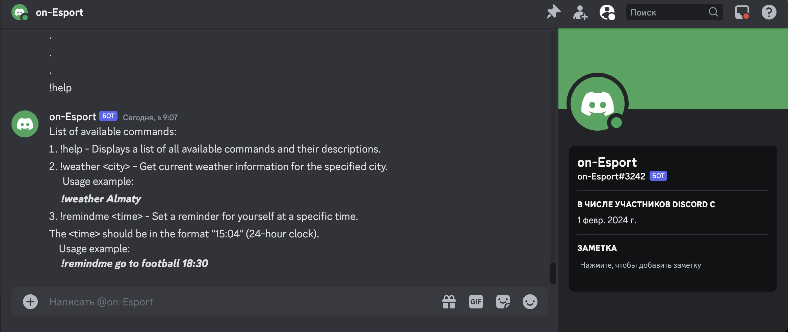
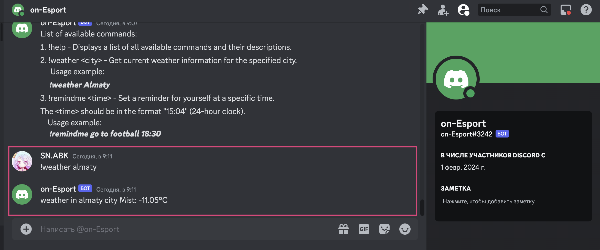
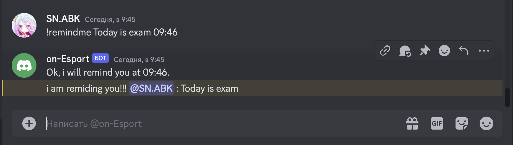

# discord-bot

This project develops discord bot with commands like reminder and get weather.
discord bot can work both in guilds and in a private message with him.

## functionality

1. ***Help***



2. ***Weather***



2. ***Remind***



## How to run
1. to run this golang bot, write token for discord bot in configs/configs.json, in the botToken field.
```
configs/configs.json
{
    "botToken": "put here your token",
    "botPrefix": "!",
    "weatherToken": "cf1a57090a3eecea91ea2f10b1ef4d41"
}

```
2. then put this command in you terminal

```
$ make run
$ make build
```